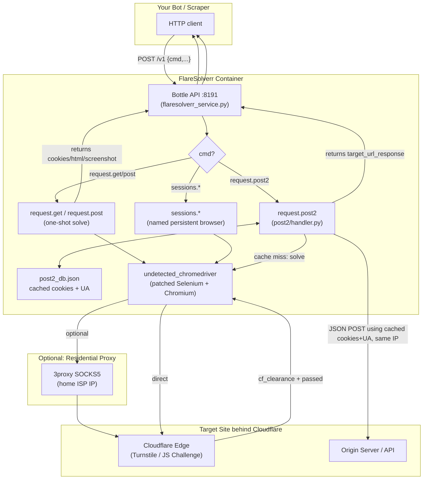
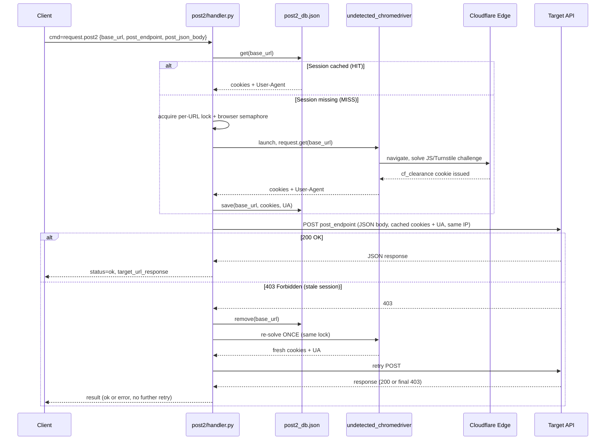

# FlareSolverr Patch

A research + engineering repo built around **[FlareSolverr](https://github.com/FlareSolverr/FlareSolverr)** — a proxy server that uses a real, undetected headless browser to defeat Cloudflare's anti-bot protections (Turnstile, JS challenges, IUAM "Just a moment...", etc.) and hand back clean cookies / responses to your scraper or bot.

This repo contains:
1. A **patched fork of FlareSolverr** with a new `request.post2` command (solve-once, cache-session, POST-JSON-many-times).
2. **Research scripts** (`drission_cf_clearance/`) used to reverse-engineer how Cloudflare's `cf_clearance` cookie and Turnstile sitekeys work.
3. A **residential SOCKS5 proxy guide** (`proxy_server/`) for boosting Cloudflare "trust score" from datacenter IPs.
4. A documented **ARM64 / Oracle Cloud deployment branch** (`oracle-cloud-deploy`) chronicling a real debugging session against Chromium sandbox crashes.

---

## Table of Contents

- [Background: What Cloudflare Is Actually Checking](#background-what-cloudflare-is-actually-checking)
- [Research Findings](#research-findings)
- [Directory Structure](#directory-structure)
- [Component Breakdown](#component-breakdown)
  - [flaresolver/FlareSolverr — the patched server](#flaresolverflaresolverr--the-patched-server)
  - [drission_cf_clearance/ — research scripts](#drission_cf_clearance--research-scripts)
  - [proxy_server/ — residential proxy guide](#proxy_server--residential-proxy-guide)
- [How It Works (Architecture)](#how-it-works-architecture)
- [`request.post2` Flow](#requestpost2-flow)
- [The `oracle-cloud-deploy` Branch (Alternative Branch)](#the-oracle-cloud-deploy-branch-alternative-branch)
- [Getting Started](#getting-started)
- [API Quick Reference](#api-quick-reference)

---

## Background: What Cloudflare Is Actually Checking

Cloudflare doesn't just check a cookie — it fingerprints the *client* as a whole. When a request looks automated, Cloudflare serves a challenge page instead of the real site. The challenge can be:

| Challenge type | What it looks like | How it's solved |
|---|---|---|
| **JS Challenge / "Just a moment..."** | An interstitial page that runs obfuscated JS, then redirects | Solved automatically by running real JS in a real browser engine |
| **Turnstile (managed challenge)** | An invisible or checkbox CAPTCHA widget | Solved by waiting for Turnstile's own risk-scoring JS to pass, occasionally requiring a checkbox click |
| **IUAM / hCaptcha** | Legacy interactive CAPTCHA | Requires visual/interactive solving (harder, mostly deprecated) |

Once passed, Cloudflare issues a **`cf_clearance` cookie**. Key research insight captured in this repo:

> The `cf_clearance` cookie is **not a simple bearer token**. It is cryptographically bound to:
> - The **client IP address** that solved the challenge
> - The **TLS/JA3 fingerprint** of the client
> - The **User-Agent** string used during the solve
> - Browser-level signals (WebGL/canvas fingerprint, navigator properties, etc.)
>
> This means you **cannot** extract a `cf_clearance` cookie from a real browser and replay it from a plain `requests`/`curl` session on a different IP or with a different User-Agent — Cloudflare will reject it. The only reliable way to reuse it is to keep making requests **from the same process/IP** that solved the challenge, with the **same User-Agent**.

This single fact is why FlareSolverr (and this patch) exist: instead of trying to fake a browser's fingerprint, you drive an actual undetected Chromium instance, solve the challenge for real, and then either:
- proxy every request through that same browser/IP, or
- extract cookies + UA and immediately replay them from the **same container/IP** before anything expires.

---

## Research Findings

Research was done using [`undetected_chromedriver`](flaresolver/FlareSolverr/src/undetected_chromedriver/) (a patched Selenium driver that hides common automation fingerprints) and [DrissionPage](https://github.com/g1879/DrissionPage) / Playwright for manual investigation:

- **`extract_cookie.py`** — drives a persistent Chromium profile to a Cloudflare-protected site, waits for the auto-bypass, then dumps `cf_clearance` + all cookies + the exact `User-Agent` to `session_data.json`. Confirms that cookies alone are useless without the matching UA.
- **`extract_sitekey.py`** — uses Playwright to sniff network traffic for `challenges.cloudflare.com` requests and extract the **Turnstile sitekey** (`0x4A...`) straight from the wire, useful for identifying which challenge widget a target site uses.
- **`fetch_api.py`** — replays the saved session (cookies + matching User-Agent + matching `Origin`/`Referer` headers) against the site's internal API to prove that a captured session *can* be reused for plain HTTP calls, as long as origin/IP/UA stay consistent.
- **Datacenter vs residential IP trust score** — requests from cloud/VPS IP ranges (AWS, Azure, Oracle Cloud, etc.) get a low Cloudflare trust score and are shown interactive challenges far more often than the same request from a residential ISP IP, which frequently passes invisibly. This motivated the `proxy_server/` SOCKS5 tunnel setup.
- **ARM64 container instability** — headless Chromium on ARM64 Docker hosts (e.g. Oracle Cloud Ampere / Coolify) crashes with SIGTRAP (`exit code -5`) due to Docker's default `seccomp` syscall filter blocking Chromium's process-cloning calls, *not* memory page size as initially suspected. Full chronology in [`docs/issue.md` on the `oracle-cloud-deploy` branch](#the-oracle-cloud-deploy-branch-alternative-branch).

---

## Directory Structure

```
FlareSolverr Patch/
├── README.md                          # This file
│
├── drission_cf_clearance/             # Manual research scripts (not part of the server)
│   ├── extract_cookie.py              # Solve CF challenge, dump cookies + UA to session_data.json
│   ├── extract_sitekey.py             # Sniff network traffic for Turnstile sitekey
│   ├── fetch_api.py                   # Replay saved session against a site's internal API
│   ├── response.json                  # Sample captured API response
│   └── session_data.json              # Sample captured cookies/UA (git-ignored in practice)
│
├── flaresolver/                       # The FlareSolverr server (patched fork) + run notes
│   ├── run_flaresolverr.md            # Docker build/run/push cheat sheet
│   ├── test_get.py                    # Manual test script for request.get
│   ├── test_post2.py                  # Manual test script for request.post2
│   └── FlareSolverr/                  # The actual server source (git submodule-style layout)
│       ├── docker-compose.yml         # Recommended way to build & run
│       ├── Dockerfile                 # Chromium + Python 3.13 slim image
│       ├── flaresolverr.service        # systemd unit for running as a host service
│       ├── package.json
│       ├── README.md                  # Patch changelog + full API docs
│       ├── requirements.txt / test-requirements.txt
│       ├── config/
│       │   └── post2_db.json          # Persisted session cache for request.post2 (mounted volume)
│       ├── html_samples/              # Saved HTML of each known Cloudflare challenge type
│       │   ├── cloudflare_captcha_hcaptcha_v1.html
│       │   ├── cloudflare_captcha_norobot_v1.html
│       │   ├── cloudflare_init_v1.html
│       │   └── cloudflare_spinner_v1.html
│       ├── resources/                 # Logo assets
│       └── src/
│           ├── flaresolverr.py         # Entry point / CLI bootstrap
│           ├── flaresolverr_service.py # Bottle web server, command dispatch (v1 endpoint)
│           ├── dtos.py                 # Request/response data classes for all commands
│           ├── sessions.py             # Named persistent browser session manager
│           ├── metrics.py              # Prometheus metrics
│           ├── utils.py                # Chrome/driver factory, proxy + headless config, platform quirks
│           ├── build_package.py
│           ├── tests.py / tests_sites.py
│           ├── bottle_plugins/         # error/logging/prometheus middleware for the Bottle server
│           │   ├── error_plugin.py
│           │   ├── logger_plugin.py
│           │   └── prometheus_plugin.py
│           ├── post2/                  # ★ Patch feature: solve-once-POST-many command
│           │   ├── handler.py           # cmd_request_post2 — core logic, locking, retry-on-403
│           │   └── db.py                # Simple JSON-file session cache (per base_url)
│           └── undetected_chromedriver/ # Vendored & patched UC driver (anti-detection Selenium wrapper)
│               ├── __init__.py          # Chrome launcher, patched to avoid CDP/automation fingerprints
│               ├── patcher.py           # Binary-patches chromedriver to strip "cdc_" automation markers
│               ├── options.py, cdp.py, devtool.py, dprocess.py, reactor.py, webelement.py
│
└── proxy_server/                       # Residential SOCKS5 proxy setup (raises CF trust score)
    ├── __init__.py
    ├── 3proxy.cfg.example              # Sample 3proxy config (SOCKS5 + auth)
    ├── README.md                       # Full Windows setup guide (firewall, port-forward, SSH tunnel alt.)
    └── test-proxy.py                   # Verifies outbound IP through the proxy
```

> **Note:** the `oracle-cloud-deploy` branch **flattens** this structure — it moves everything out of `flaresolver/FlareSolverr/` into the repo root and adds `docs/issue.md` + `config/chromium-seccomp.json`. See [below](#the-oracle-cloud-deploy-branch-alternative-branch).

---

## Component Breakdown

### `flaresolver/FlareSolverr` — the patched server

A fork of the original [FlareSolverr](https://github.com/FlareSolverr/FlareSolverr) project. It runs a headless, undetected Chromium instance behind a small Bottle HTTP API. On top of the original `request.get` / `request.post` / `sessions.*` commands, this fork adds:

- **`request.post2`** (in `src/post2/handler.py` + `src/post2/db.py`): solves the Cloudflare challenge for a site **once**, caches the resulting cookies + User-Agent to a JSON file (`config/post2_db.json`), and then serves subsequent **JSON POST** requests to any endpoint on that site directly from inside the container (matching IP/UA), without re-launching a browser each time.
  - Per-`base_url` locking + semaphore-limited concurrent browsers (`MAX_BROWSERS`) so multiple simultaneous requests to the same site coalesce into a single solve.
  - Automatic **one-shot retry**: a `403` response evicts the cached session, re-solves the challenge, and retries the POST once before giving up.
- Patched `undetected_chromedriver` — strips Selenium's `cdc_` automation markers from the driver binary so Cloudflare/JS fingerprinting can't detect it's an automated Selenium session.

### `drission_cf_clearance/` — research scripts

Standalone scripts (independent of the FlareSolverr server) used purely for **manual investigation** of how Cloudflare issues and validates its clearance cookie, and how the Turnstile widget is embedded on a target page. Useful reference/debug tooling, not part of the production API.

### `proxy_server/` — residential proxy guide

A guide + config sample for running [3proxy](https://3proxy.ru/) as a SOCKS5 proxy on a home PC, so a remote Docker/VPS instance can route its Chromium traffic through a **residential IP**. Since Cloudflare scores datacenter IP ranges as higher risk, tunneling through a home ISP connection significantly reduces how often interactive Turnstile challenges are triggered.

---

## How It Works (Architecture)



---

## `request.post2` Flow

The key patch feature — solve the Cloudflare challenge once, then reuse the session for many JSON POSTs:



---

## The `oracle-cloud-deploy` Branch (Alternative Branch)

`main` holds the patch feature-set described above. The **`oracle-cloud-deploy`** branch is a **deployment-hardening branch**, not a feature branch — it exists to document and fix a real production incident when deploying this FlareSolverr fork to an **ARM64 Oracle Cloud (Ampere ARM) instance behind Coolify**.

What it changes:

- **Repo layout flattened**: `flaresolver/FlareSolverr/*` is moved to the repo root (`Dockerfile`, `docker-compose.yml`, `src/`, etc.) so Coolify/Docker can build directly from the repo root without a nested path.
- **`docs/issue.md`** — a full, timestamped chronology of the ARM64 debugging session (kept in this repo for future reference). Summary of the root-cause chain:

  ```mermaid
  flowchart LR
      A["cannot connect to chrome\n(SessionNotCreatedException)"] --> B["Add port-polling wait\nfor Chrome remote-debug port"]
      B --> C["Port never opens\n(120s timeout)"]
      C --> D["Force use_subprocess=True\n(keep direct process handle)"]
      D --> E["Chrome crashes:\nexit code -5 (SIGTRAP)"]
      E --> F{"Root cause?"}
      F -->|"Theory 1: 64K page size"| G["Ruled out\n(host reports 4096 / 4KB)"]
      F -->|"Theory 2: Docker seccomp\nblocks clone/process syscalls"| H["Confirmed"]
      H --> I["Fix: security_opt seccomp=unconfined\n+ shm_size 1gb + cap_add SYS_ADMIN"]
      I --> J["Chromium boots successfully"]
      J --> K["Hardening: custom minimal seccomp\nprofile (config/chromium-seccomp.json)\ninstead of fully unconfined"]
  ```

- **`config/chromium-seccomp.json`** — a minimal custom seccomp profile that whitelists only the syscalls Chromium needs (e.g. `clone3`, `pidfd_open`) as a more secure alternative to disabling seccomp entirely.
- **`Dockerfile` changes** — pins exact Chromium/driver package versions (`147.0.7727.137-1~deb12u1`) instead of `latest`, to avoid version drift breaking the ARM64 build again.
- **`docker-compose.yml` changes** — adds `security_opt: seccomp=unconfined` (or path to the custom profile), `shm_size: 1gb`, and `cap_add: [SYS_ADMIN]` required for headless Chromium to run at all on this host.
- **`src/undetected_chromedriver/__init__.py` / `src/utils.py`** — platform-aware startup path: waits for the Chrome debug port to open, forces `use_subprocess=True` and disables `--no-zygote` on ARM64, with extra diagnostics if Chrome dies early.

In short: **`main`** = the feature (patched FlareSolverr + `request.post2`). **`oracle-cloud-deploy`** = "how to actually get that container running reliably on an ARM64 cloud host," preserved as a branch so the root-caused fix and its research trail aren't lost.

---

## Getting Started

### 1. Run the patched FlareSolverr server

```bash
cd flaresolver/FlareSolverr
docker-compose up -d --build
```

Server comes up on `http://localhost:8191`. See [`flaresolver/run_flaresolverr.md`](flaresolver/run_flaresolverr.md) for manual `docker build` / `docker run` / push-to-GHCR commands.

> Deploying to an **ARM64** host (Oracle Cloud, Raspberry Pi, etc.)? Use the `oracle-cloud-deploy` branch and read `docs/issue.md` first — you will need `security_opt: seccomp=unconfined` (or the provided custom seccomp profile) and `shm_size: 1gb` or the container will crash on boot.

### 2. Call the patched `request.post2` endpoint

```bash
curl -X POST http://localhost:8191/v1 \
  -H "Content-Type: application/json" \
  -d '{
        "cmd": "request.post2",
        "base_url": "https://example.com",
        "post_endpoint": "api/data",
        "post_json_body": { "key": "value" }
      }'
```

### 3. (Optional) Boost Cloudflare trust score with a residential proxy

Follow [`proxy_server/README.md`](proxy_server/README.md) to stand up a 3proxy SOCKS5 tunnel on a home PC and set `PROXY_URL` on the container so Chromium's traffic exits through a residential IP instead of the datacenter IP.

### 4. (Optional) Manual Cloudflare research tooling

```bash
cd drission_cf_clearance
pip install DrissionPage playwright requests
python extract_cookie.py     # solve challenge, dump session_data.json
python extract_sitekey.py    # sniff Turnstile sitekey from network traffic
python fetch_api.py          # replay captured session against the site's API
```

---

## API Quick Reference

| Command | Purpose |
|---|---|
| `GET /` | Server status + current User-Agent |
| `GET /health` | Healthcheck |
| `POST /v1 {"cmd":"request.get", "url": ...}` | Fetch a URL, auto-solving any Cloudflare challenge |
| `POST /v1 {"cmd":"request.post", "url": ..., "postData": ...}` | Form POST through the browser, auto-solving CF |
| `POST /v1 {"cmd":"request.post2", "base_url", "post_endpoint", "post_json_body"}` | ★ Patch feature — solve once, cache session, JSON POST many times |
| `POST /v1 {"cmd":"sessions.create", "session": "id"}` | Create/reuse a named persistent browser session |
| `POST /v1 {"cmd":"sessions.list"}` | List active named sessions |
| `POST /v1 {"cmd":"sessions.destroy", "session": "id"}` | Destroy a named session |

Key environment variables: `HOST`, `PORT`, `LOG_LEVEL`, `HEADLESS`, `PROXY_URL` / `PROXY_USERNAME` / `PROXY_PASSWORD`, `MAX_BROWSERS`, `CF_SOLVE_TIMEOUT_MS`, `POST2_DB_PATH`. Full docs in [`flaresolver/FlareSolverr/README.md`](flaresolver/FlareSolverr/README.md).
